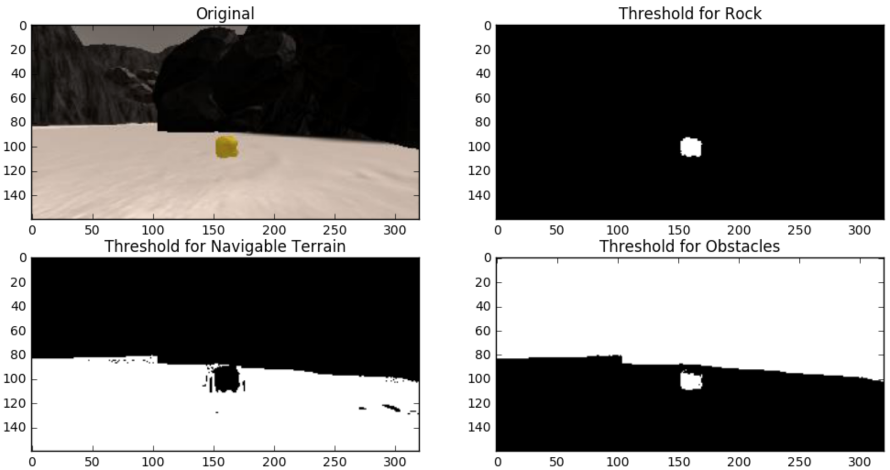

# Search and Sample Return Project

This project is modeled after the [NASA sample return challenge](https://www.nasa.gov/directorates/spacetech/centennial_challenges/sample_return_robot/index.html) and covers the three essential elements of robotics - perception, decision making and actuation.  This project runs in simulator environment built with the Unity game engine.  

## The Simulator
Lnks for [Linux](https://s3-us-west-1.amazonaws.com/udacity-robotics/Rover+Unity+Sims/Linux_Roversim.zip), [Mac](	https://s3-us-west-1.amazonaws.com/udacity-robotics/Rover+Unity+Sims/Mac_Roversim.zip), or [Windows](https://s3-us-west-1.amazonaws.com/udacity-robotics/Rover+Unity+Sims/Windows_Roversim.zip). 

## Dependencies
Python 3 and Jupyter Notebooks. Udacity has provided an Anaconda environment with all dependencies [RoboND-Python-Starterkit](https://github.com/ryan-keenan/RoboND-Python-Starterkit). 

## Notebook Data Analysis

#### Color Thresholding
Modify color_thresh to accept minimum and maximum thresholds as parameters. Trial and error used to find appropriate min/max thresholds for the rocks. 
```
threshed_rock = color_thresh(img, (100,100,0), (255, 255, 30))
threshed_nav = color_thresh(img, (160,160,160))
threshed_obs = color_thresh(img, (0,0,0), (160, 160, 160))
```


#### Process Images
There are 7 steps to in the perception pipeline to process each image. Most steps use the functions derived in the lessons. Importantly, the color thresholding comes before the perspective transform, otherwise the transform/threshold for the obstacle pixels will incorrectly identify pixels as being obstacles. This happens because the perspective transform results in an image with a 'V' shape, and the pixels outside of this 'V' should be ignored.

  1. Apply color thresholds to create binary image identifying pixels corresponding to navigable terrain, obstacles, and rocks
  ```
  obstacle_thresh = color_thresh(img, (0,0,0), (160,160,160))
  navigable_thresh = color_thresh(img, (160,160,160))
  rock_thresh = color_thresh(img, (100,100,0), (255, 255, 20))
  ```
  2. Define source and destination points for perspective transform
  ```
  dst_size = 5 
  bottom_offset = 6
  source = np.float32([[14, 140], [301 ,140],[200, 96], [118, 96]])
  destination = np.float32([[image.shape[1]/2 - dst_size, image.shape[0] - bottom_offset],
                  [image.shape[1]/2 + dst_size, image.shape[0] - bottom_offset],
                  [image.shape[1]/2 + dst_size, image.shape[0] - 2*dst_size - bottom_offset], 
                  [image.shape[1]/2 - dst_size, image.shape[0] - 2*dst_size - bottom_offset],
                  ])
  ```
  3. Apply perspective transform
  ```
  obstacle_warped = perspect_transform(obstacle_thresh, source, destination)
  navigable_warped = perspect_transform(navigable_thresh, source, destination)
  rock_warped = perspect_transform(rock_thresh, source, destination)
  ```
  4. Convert thresholded and warped image pixel values to rover-centric coordinates
  ```
  obstacle_x_rover, obstacle_y_rover = rover_coords(obstacle_warped)
  navigable_x_rover, navigable_y_rover = rover_coords(navigable_warped)
  rock_x_rover, rock_y_rover = rover_coords(rock_warped)
  ```
  5. Convert rover-centric coordinates to world coordinates
  ```
  obstacle_x_world, obstacle_y_world = pix_to_world(obstacle_x_rover, obstacle_y_rover, data.xpos[data.count], data.ypos[data.count], data.yaw[data.count], data.worldmap.shape[0], 10)
  navigable_x_world, navigable_y_world = pix_to_world(navigable_x_rover, navigable_y_rover, data.xpos[data.count], data.ypos[data.count], data.yaw[data.count], data.worldmap.shape[0], 10)
  rock_x_world, rock_y_world = pix_to_world(rock_x_rover, rock_y_rover, data.xpos[data.count], data.ypos[data.count], data.yaw[data.count], data.worldmap.shape[0], 10)
  ```
  6. Update world map by setting the detected pixels to their respective color channel (obstacles = red, navigable terrain = blue, rocks = white)
  ```
  data.worldmap[obstacle_y_world, obstacle_x_world, 0] = 255
  data.worldmap[navigable_y_world, navigable_x_world, 2] = 255
  data.worldmap[rock_y_world, rock_x_world, :] = 255
  ```
  7. Create output image for the video (unmodified)
  

## Autonomous Navigation and Mapping

#### perception_step()
This funciton performs the same steps as the process_image step defined in the jupyter notebook above, with a few of modifications:
  1. Use the Rover object instead of the DataBucket object
  2. Rover.vision_image is updated to show navigable terrain, obstacles, and rocks in the output video
  3. is_valid_rotation() is used to check if the Rover pitch and roll are near 0. If so, allow the worldmap to be updated, else, ignore this image as the persepctive transform can be off
  4. Add "weight" to color channels of the worldmap when terrain, obstacles, and rocks are detected. This allows us to decide how to label the pixel based on multiple detections
  5. Convert rover-centric navigable terrain pixel positions to polar coordinates. These are used in the decision step below

#### decision_step()
This function uses the polar coordinates derived in the previous step to make decisions about throttle, brake, and steer. The core idea driving the steering is using the average angle of the detected navigable terrain as the steering angle. This has the effect of the Rover driving into the "most open space" that it detects as being navigable. If the Rover drives into an area that doesn't meet our threshold for enough navigable terrain, it will stop and turn left (in place) until it finds navigable terrain, then accelerate again. 


## Results and Improvements

#### 


